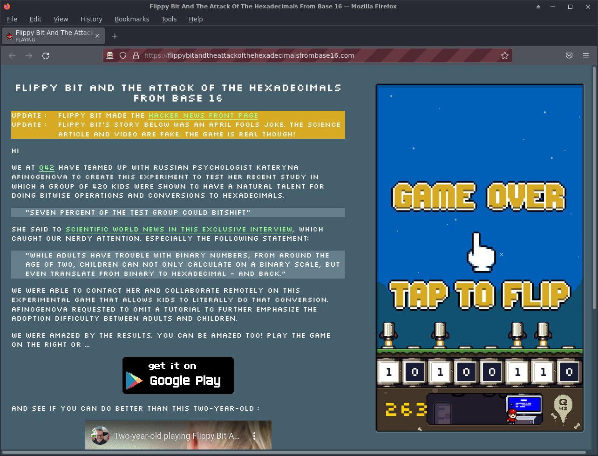

# Selenium plays Flippy Bit and the Attack of the Hexadecimals from Base16

To see it playing, install selenium from PyPi or your package manager and then run:

$ `python3 play.py`

## My best score

I got 263 points on a:
- i7 4790 + Intel HD Graphics 4600
- No discrete GPU
- Firefox 96.0
- Archlinux
- Kernel 5.15.13-zen1-1-zen

### Why no higher score?

This screen makes my computer lag.
